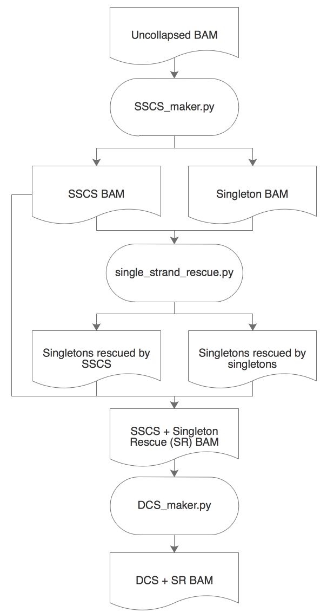

# README - Tools for Barcode Sequencing #

This README would normally document whatever steps are necessary to get your application up and running.

## What is this repository for? ##

* Runs the molecular barcode / duplex sequencing pipeline for duplicate removal and error suppression

## How do I get set up? ##

### Summary of Set Up ###
1. Run tag_to_header.py on fastq files to remove barcodes and spacer
2. Align fastqs (Recommendation: bwa mem)
3. Process bams through GATK IndelRealigner (If you're following GATK best practices guidelines, don't mark duplicates)
4. runDuplexPipeline.sh

### Configuration ###
Set up runDuplexPipeline.sh
- Input git directory as codedir 
- Setup cluster configuration (default SGE cluster with highmem.q) 

Note: depending on the size of your bamfiles, software might require a lot of memory resources

<code>sh [Duplex Sequencing git directory]/runDuplexPipeline.sh ProjectDir BamDir Bedfile<code>

This script will feed bamfiles into the DuplexPipeline.sh
1. Single stranded consensus sequence (SSCS) maker
2. Duplex consensus sequence (DCS) maker
3. Singlet strand rescue (SR)
4. Merge SSCS and Rescued singletons
5. Duplex consensus sequence maker from SSCS + rescued singletons (DCS_SR)
6. Generate all unique molecular bamfiles 

### Dependencies ###
This pipeline requires the following dependencies:
| Program | Version | Purpose |
|---------|---------|---------|
| Python3 | 3.5.1 | Consensus sequence pipeline |
| Pysam | 0.9.0 | Python interface for working with bamfiles |
| Samtools | 1.3.1 | Sorting and indexing bamfiles |
| Picard | 2.6.0 | Merging bamfiles |
| Java | 8 | Used with Picard to merge bamfiles |

# Intro to Molecular Barcoding #

### Bamfiles ###
Uncollapsed: Original bamfiles
SSCS: Single strand consensus sequences
SSCS_SR: Single strand consensus sequences with rescued singletons
All_unique_sscs: Single strand consensus sequences + rescued singletons + remaining (unrescued) singletons 
DCS: Duplex consensus sequences
DCS_SR: Duplex consensus sequences from SSCS_SR
All_unique_dcs: Duplex consensus sequences from SSCS_SR + SSCS SR Singletons + remaining singletons
Singletons: Single reads

### Who do I talk to? ###

* Repo owner or admin (Nina)